<!-- HEADER BANNER -->

<!-- TYPING SVG -->

<!-- BADGES & VISITORS -->

 

<!-- ABOUT ME -->

 

<!-- SKILLS & ARSENAL -->

 

  
  
  
  
  
  
  

 

<!-- CURRENTLY LEARNING -->

  
  
  

 

<!-- STATS -->

 

 

<!-- SNAKE CONTRIBUTION -->

  <picture>
    <source media="(prefers-color-scheme: dark)" srcset="https://raw.githubusercontent.com/sickially/sickially/output/github-snake-dark.svg" />
    <source media="(prefers-color-scheme: light)" srcset="https://raw.githubusercontent.com/sickially/sickially/output/github-snake.svg" />
    
  </picture>

<!-- FOOTER -->

